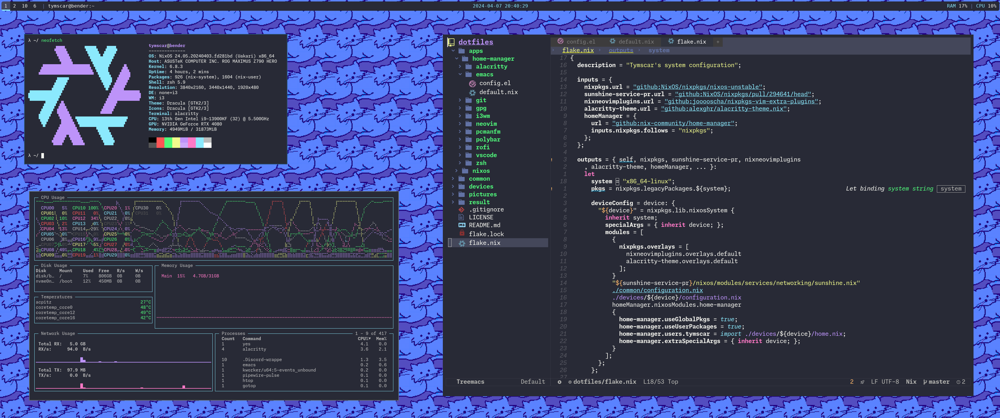

Tymscar's dotfiles
==================

Here I keep all my dotfiles serving the purpose of sharing but also as a backup for myself. I use [Nix](https://nixos.org/) to manage them. Feel free to take a look!

Here is an example of how I set up my desktop (bender) using my config.

<p align="center">  </p> 

All you have to do before running these commands is to install Nixos on a desktop.

```bash
nix-shell -p git
git clone https://www.github.com/tymscar/dotfiles
cp /etc/nixos/hardware-configuration.nix dotfiles/devices/bender
sudo nixos-rebuild switch --flake "./dotfiles#bender"
```

I am thinking through a better way of handling hardware configs, but because each install has a different set of UUIDs for each partition, I can't really automate that yet.
After running those commands, all you have to do is reboot. If you want to use this for yourself, I would suggest changing the username, and SSH keys at least.
